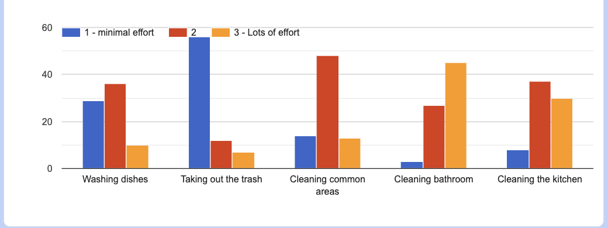

- Observation 1: 
    - Observation Statement: People generally find cleaning shared spaces (living room, bathroom, kitchen) to be more effort
    - Supporting Data: 
    
    - Team Action (if any): Considering how people view the effort required for different chores we can take that into consideration when deciding how chores will be randomly assigned as to not give the same person a high effort chore multiple times in a row.

- Observation 2:
    - Observation Statement: A majority user complaints agree that roommates do not share chores, and can be messy, oftentimes taking on the brunt of the cleaning themselves
    - Supporting Data: 32/49 total responses to the question "What don't you like about living with roommates?" mentioned one point about cleanliness or uneven chore splitting between roommates. 
    - Team Action (if any): We can prioritize cleaning chores for users, and evenly distribute these chores among roommates so that each individial has incentive to clean at least once, rather than one person doing all of the work. This is also a way to ensure that the chore gets done. 

- Observation 3:
    - Observation Statement:
    - Supporting Data:
    - Team Action (if any):

- Observation 4:
    - Observation Statement:
    - Supporting Data:
    - Team Action (if any):

- Observation 5: Survey participants explained how living with other indiviuals is socially fullfulling; being able to connect and collaberate with others in a shared space. 
    - Observation Statement: What do you like about living with roommates? (Section on GSheets) 
    - Supporting Data: 
        - (U8) "Connecting and getting to know new people, as well as experiencing living with strangers."
        - (U17) "Another person in the same living space to spend time with."
        - (U29) "Shared responsibility"
        - (U34) "Always having people around to talk to and hang out"
    - Team Action (if any): We can implement social features to ensure the usablilty and satisfaction of ROOMIE!